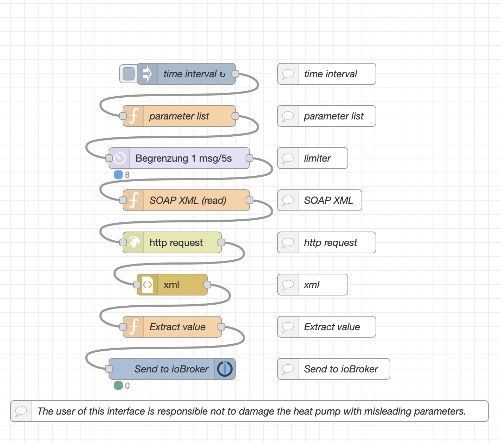
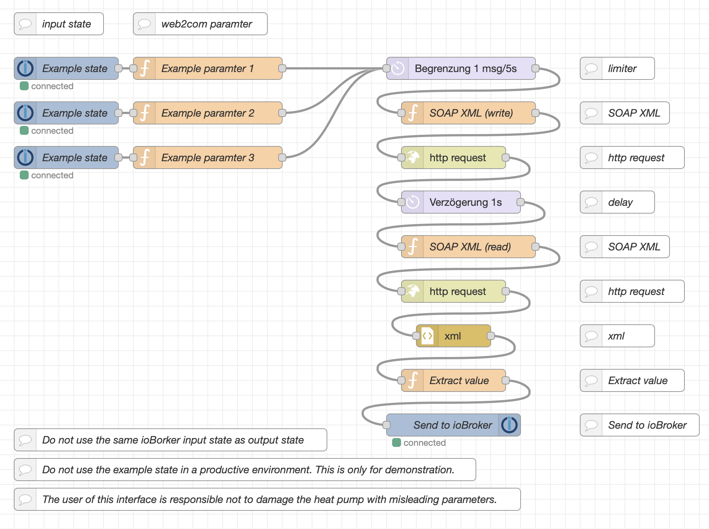

# ioBroker_web2com

Use the Node-RED adapter to read and write paramters of the ochser web2com interface.
Tested with the ioBroker version 6.17.14 and Node-RED version 3.1.11.

Install the Node-RED adapter and inport the flow.
Follow the comments to change the paramters to your local needs.

## web2com_datalogger

## web2com_settings

